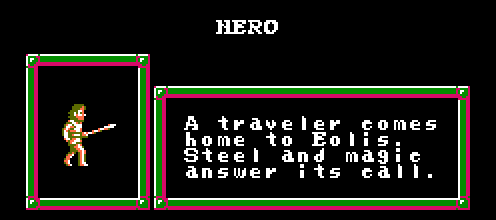
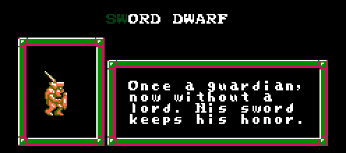
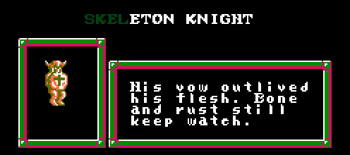
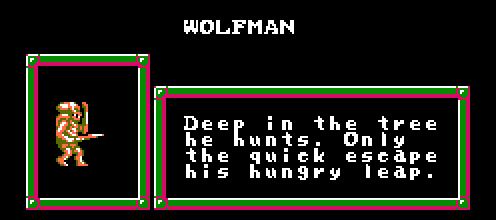
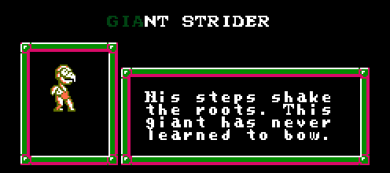
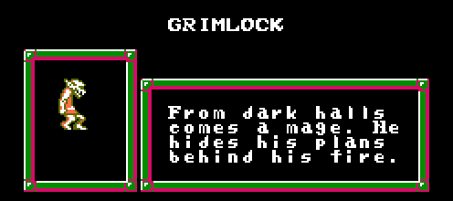

# Faxanadu Battle 1.5 — les combattants

*[English version](FIGHTERS.md)* · *[Retour à Faxanadu Battle](README.fr.md)*

Six combattants, et un septième qu'il faut trouver. Chacun est cité ici avec
sa carte d'introduction, dont le texte reste en anglais comme dans le jeu. Ce ne sont pas des copies
les uns des autres : chacun a sa vitesse, son saut, sa portée, ses dégâts et
son timing, plus une attaque spéciale qui coûte une jauge de pouvoir pleine.

## Comment lire les chiffres

La **vitesse**, c'est la distance parcourue à chaque mise à jour, et le
**saut**, la force de la détente : plus le chiffre est gros, plus le saut est
haut. La **portée**, c'est jusqu'où le coup touche devant, en pixels.

Le **timing**, c'est ce qui décide des échanges. Un coup a trois parties : le
**départ** avant qu'il puisse toucher, les cinq mises à jour où il est
**actif**, et la **récupération** dans laquelle vous êtes coincé après. Un
départ court gagne les courses. Une longue récupération, c'est ce qui vous
fait punir quand vous ratez.

Tout ça, c'est de l'équilibrage écrit pour ce jeu. Rien à voir avec le
comportement de ces monstres dans Faxanadu.

## Le roster en un coup d'œil

| Combattant | Vitesse | Saut | Dégâts | Portée | Départ / actif / récup. |
| --- | ---: | ---: | ---: | ---: | --- |
| Hero | 1 | 6 | 12 | 29 | 3 / 5 / 7 |
| Sword Dwarf | 2 | 5 | 12 | 29 | 5 / 5 / 10 |
| Skeleton Knight | 1 | 6 | 16 | 37 | 7 / 5 / 11 |
| Wolfman | 2 | 7 | 8 | 25 | 2 / 5 / 7 |
| Giant Strider | 1 | 4 | 20 | 33 | 10 / 5 / 12 |
| Grimlock | 3 | 5 | 10 | 27 | 4 / 5 / 9 |

| Combattant | Spéciale | Dégâts | Ce qu'elle fait |
| --- | --- | ---: | --- |
| Hero | Blade Beam | 24 | un projectile rapide, six pixels par mise à jour |
| Sword Dwarf | Shoulder Rush | 24 | une charge avant qui touche pendant le trajet |
| Skeleton Knight | Skewer | 28 | un coup d'estoc engagé, 53 pixels de portée |
| Wolfman | Pounce | 22 | un bond avant qui touche vers le bas |
| Giant Strider | Ground Slam | 32 | un saut et une chute rapide, qui frappe tout autour |
| Grimlock | Retreat Shot | 20 | recule en tirant un projectile plus lent |

---

## Hero

> A traveler comes home to Eolis. Steel and magic answer its call.

Celui que tout le monde sait déjà jouer. Rien d'extrême chez le Hero : dégâts
moyens, portée moyenne, et le deuxième coup le plus rapide du jeu avec trois
mises à jour de départ et seulement sept de récupération. C'est cette
récupération courte qui fait sa qualité : vous pouvez appuyer, avoir tort, et
être encore debout.

**Blade Beam** est la seule spéciale qui menace d'un bout à l'autre de
l'arène. Six pixels par mise à jour, c'est assez vite pour qu'un adversaire
lointain doive bouger au lieu d'attendre.

Prenez le Hero pour apprendre. Rien de ce que vous apprenez avec lui n'est
perdu sur les autres.

## Sword Dwarf

> Once a guardian, now without a lord. His sword keeps his honor.

Les dégâts et la portée du Hero, mais il marche deux fois plus vite et saute
un peu moins haut. Ça se paye sur le coup : cinq mises à jour de départ et
dix de récupération, donc il perd les courses contre les rapides et
reste planté plus longtemps quand il rate.

**Shoulder Rush** touche pendant le trajet, ce qui en fait à la fois un moyen
de coller l'adversaire et une punition. C'est la spéciale qui change le plus
l'endroit où se joue le combat.

Jouez-le en pression. Poussez l'autre dans un coin et forcez-le à sauter.

## Skeleton Knight

> His vow outlived his flesh. Bone and rust still keep watch.

La plus longue portée ordinaire du jeu, 37 pixels, avec 16 dégâts derrière.
Il est lent sur ses jambes et lent à frapper, sept mises à jour de départ et
onze de récupération : c'est le prix à payer pour se tenir hors de portée de
tout le monde.

**Skewer** va à 53 pixels, plus loin que n'importe quel autre coup. C'est
engagé, donc un coup dans le vide se paye cher, mais ça couvre un espace que
rien d'autre ne couvre.

Tenez une place et faites venir les gens. Le Skeleton perd les combats qu'il
court après.

## Wolfman

> Deep in the tree he hunts. Only the quick escape his hungry leap.

Les mains les plus rapides du jeu : deux mises à jour de départ, sept de
récupération, et le saut le plus haut. C'est aussi lui qui fait le moins de
dégâts, huit par coup, avec la portée la plus courte à 25 : il doit rentrer
dedans et y rester.

C'est également celui qui est projeté le plus loin quand il se fait toucher,
trois pixels par mise à jour de recul contre un ou deux pour les autres, donc
une seule erreur lui coûte la position qu'il a mis du temps à gagner.

**Pounce** bondit vers l'avant et touche vers le bas : c'est comme ça qu'il
rentre contre quelqu'un qui tient sa ligne.

Le combattant le plus exigeant d'ici, et le plus gratifiant quand ça marche.

## Giant Strider

> His steps shake the roots. This giant has never learned to bow.

Vingt dégâts par coup, le coup normal le plus fort du jeu, avec 33 de portée
derrière. Tout le reste est une concession : lent, le saut le plus faible à
quatre, dix mises à jour de départ et douze de récupération. Quand il
rate, toute l'arène le sait.

**Ground Slam** est le seul coup qui n'a aucune orientation. Il saute, tombe
vite, et frappe tout autour de l'endroit où il atterrit, 46 pixels dans
toutes les directions, mais seulement une fois posé. Huit mises à jour
actives, puis vingt-trois de récupération : soit ça gagne la manche, soit
c'est la pire chose que vous ayez faite.

Trois coups propres, c'est un Duel gagné. Placer trois coups propres, c'est
tout le problème.

## Grimlock

> From dark halls comes a mage. He hides his plans behind his fire.

Le marcheur le plus rapide, trois pixels par mise à jour, moitié plus vite
que n'importe qui, avec un coup vif à quatre mises à jour de départ. Les
dégâts sont bas à dix et la portée courte à 27 : il gagne en étant là où
l'autre n'est pas.

**Retreat Shot** est la seule spéciale qui vous éloigne du danger tout en
attaquant. Le projectile lui-même est lent, trois pixels par mise à jour, ce
qui en fait un abri plutôt qu'un finisher.

Jouer à distance n'est pas un gros mot. Grimlock est fait pour ça.

## Le septième

Il y en a un de plus. Il n'est pas sur l'écran de sélection au départ, et le
trouver fait partie du jeu : ce guide ne vous le dira pas.

---

## Les coups que tout le monde a

**Attaque chargée.** Maintenez B et relâchez. Dégâts doublés, quatre pixels
de portée en plus, et ça traverse une garde. Ça coûte aussi quatre mises à
jour de départ et trois de récupération en plus : c'est une lecture, pas une
habitude.

**Attaque montante.** Haut et B. Elle soulève un adversaire au sol et peut
cueillir quelqu'un qui vous retombe dessus. La portée est de 22 pour tout le
monde, le timing de quatre mises à jour de départ, sept actives et neuf de
récupération, et les dégâts font 14, 16, 16, 12, 22 et 12 dans l'ordre du tableau ci-dessus.

**Attaque aérienne.** B en l'air. Deux dégâts de moins que le coup au sol
avec un plancher à huit, deux de portée en plus, et un timing bien plus court
à deux mises à jour de départ, sept actives et six de récupération.

**Garde.** Maintenez Bas au sol pour bloquer une attaque venant de face. Ça
consomme du pouvoir, et une attaque chargée passe au travers.

## Le pouvoir

La jauge se remplit en se battant, pas en attendant : seize pour un coup
placé, huit pour un coup encaissé qui ne vous achève pas. Une spéciale ne
peut pas se rembourser elle-même. Tout le monde commence la manche avec une
charge déjà disponible, donc la première spéciale peut tomber n'importe quand.

## Petites choses à savoir

Un coup ne peut blesser son adversaire qu'une fois : impossible de traverser
quelqu'un avec un coup actif pour toucher plusieurs fois. Les projectiles
disparaissent après 48 mises à jour. Le contact fige les deux combattants
pendant deux mises à jour, et c'est ce qui fait qu'un coup se *sent* comme
un coup ; les timers d'attaque n'avancent pas pendant ce temps et vos entrées
ne sont pas jetées.

Le recul dépend de qui encaisse, pas de qui frappe. Sword Dwarf et Giant
Strider sont poussés d'un pixel par mise à jour, Hero, Skeleton Knight et
Grimlock de deux, et Wolfman de trois.
